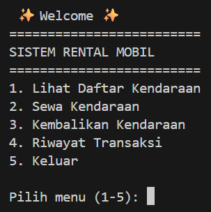
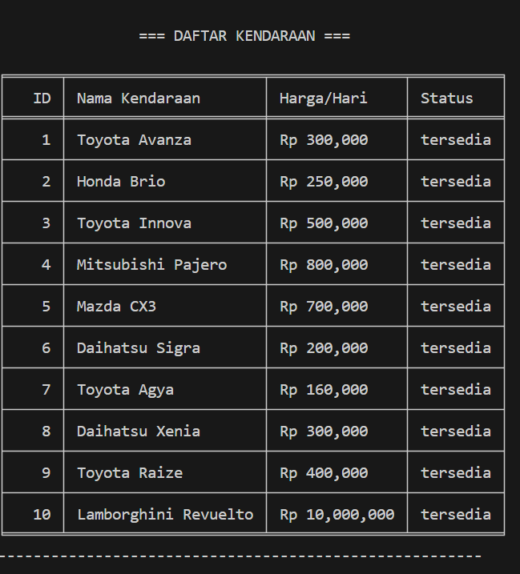
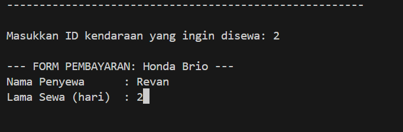
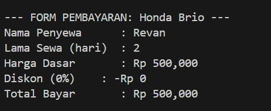
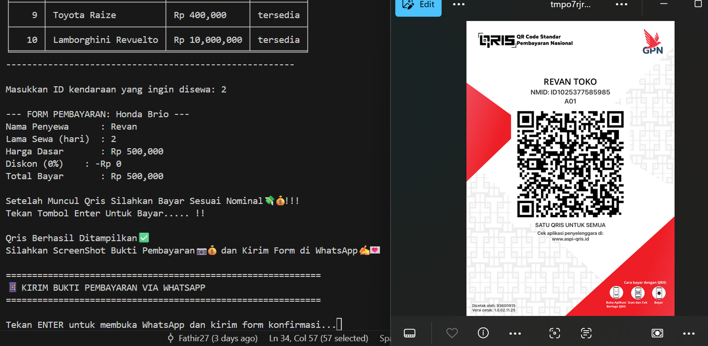
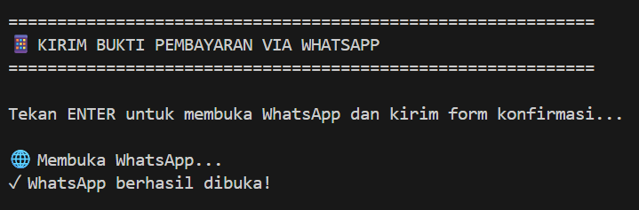
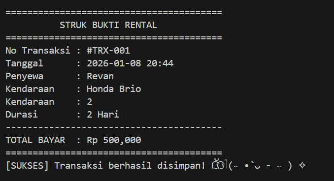
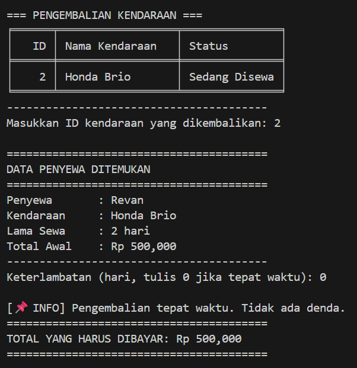
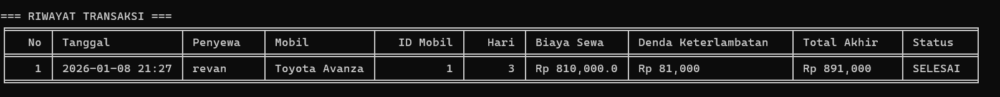

# 🚗 Sistem Rental Mobil

Aplikasi console-based untuk mengelola penyewaan mobil dengan fitur pembayaran QRIS dan konfirmasi WhatsApp otomatis.

---

## ✨ Fitur Utama

1. **📋 Lihat Daftar Kendaraan** - Tampilkan semua mobil dengan harga dan status ketersediaan
2. **🎟️ Sewa Kendaraan** - Proses penyewaan dengan diskon otomatis, QRIS, dan konfirmasi WhatsApp
3. **🔄 Kembalikan Kendaraan** - Pengembalian mobil dengan perhitungan denda keterlambatan
4. **📜 Riwayat Transaksi** - Lihat semua transaksi yang pernah dilakukan

---

## 📥 Instalasi

### 1. Clone Repository
```bash
git clone https://github.com/vanncoding/sistem-penyewaan-barang.git
cd sistem-penyewaan-barang
```

### 2. Install Dependencies
```bash
pip install pandas pillow tabulate
```

### 3. Jalankan Program
```bash
python sewa-barang.py
```

---

## 🚀 Cara Penggunaan

### **STEP 1: Menu Utama**

Setelah menjalankan program, akan muncul menu utama:


```
 ✨ Welcome ✨ 
=========================
SISTEM RENTAL MOBIL
=========================
1. Lihat Daftar Kendaraan
2. Sewa Kendaraan
3. Kembalikan Kendaraan
4. Riwayat Transaksi
5. Keluar

Pilih menu (1-5):
```

---

### **STEP 2: Lihat Daftar Kendaraan**

Pilih menu **1** untuk melihat semua mobil yang tersedia.



Program akan menampilkan:
- ID Kendaraan
- Nama Mobil
- Harga per Hari
- Status (Tersedia/Sedang Disewa)

---

### **STEP 3: Sewa Kendaraan**

#### 3.1 Input Data Penyewa

Pilih menu **2**, lalu masukkan:
- ID kendaraan yang ingin disewa
- Nama penyewa
- Lama sewa (hari)



#### 3.2 Lihat Total Biaya

Program akan menghitung total biaya dengan **diskon otomatis**:
- Sewa 3-6 hari: Diskon 5%
- Sewa 7-13 hari: Diskon 10%
- Sewa 14+ hari: Diskon 15%



#### 3.3 Pembayaran QRIS

Tekan **ENTER**, gambar QRIS akan muncul untuk pembayaran.



Scan QRIS menggunakan aplikasi e-wallet untuk melakukan pembayaran.

#### 3.4 Konfirmasi via WhatsApp

Tekan **ENTER** lagi, WhatsApp akan terbuka otomatis dengan pesan yang sudah terisi.



Kirim screenshot bukti pembayaran ke admin.

#### 3.5 Struk Transaksi

Setelah konfirmasi, program akan mencetak struk digital.



---

### **STEP 4: Kembalikan Kendaraan**

Pilih menu **3** untuk mengembalikan mobil.



Program akan:
1. Menampilkan mobil yang sedang disewa
2. Meminta input ID mobil yang dikembalikan
3. Menghitung denda (jika terlambat)
4. Update status mobil jadi tersedia

**Denda keterlambatan:** 10% dari total biaya per hari

---

### **STEP 5: Riwayat Transaksi**

Pilih menu **4** untuk melihat semua transaksi.



Informasi yang ditampilkan:
- Nomor transaksi
- Tanggal & waktu
- Nama penyewa
- Mobil yang disewa
- Biaya sewa
- Denda (jika ada)
- Status (Aktif/Selesai)

---

## 🛠️ Teknologi

- **Python 3.x**
- **Pandas** - Manipulasi data
- **Pillow** - Tampilkan gambar QRIS
- **Tabulate** - Format tabel
- **Webbrowser** - Buka WhatsApp otomatis

---

## ⚙️ Konfigurasi

### Ganti Nomor WhatsApp Admin

Buka file `sewa-barang.py`, cari baris ini:
```python
nomor_wa = "6285773840478"  # Ganti dengan nomor admin
```

**Format:** 62 + nomor HP (tanpa 0 di depan)
- Contoh: 081234567890 → 6281234567890

---

## 📁 Struktur File
```
sistem-penyewaan-barang/
├── sewa-barang.py         # Program utama
├── modul_diskon.py        # Modul perhitungan diskon
├── qris.jpg               # Gambar QRIS pembayaran
├── README.md              # Dokumentasi
└── images/                # Folder screenshot (tambahkan sendiri)
    ├── menu-utama.png
    ├── daftar-kendaraan.png
    ├── input-data.png
    ├── total-biaya.png
    ├── qris-payment.png
    ├── whatsapp-form.png
    ├── struk-transaksi.png
    ├── pengembalian.png
    └── riwayat-transaksi.png
```

---

## 👥 Tim Pengembang

| Nama | Tugas |
|------|-------|
| Zuqy | Modul Diskon |
| Dapa | Tabel Pandas |
| Revan | Pembayaran, Readme, QRIS & WhatsApp |
| Fathir | Halaman Utama, Riwayat, Sewa Kendaraan & Pengembalian Kendaraan |
| Gilang | Membuat PPT |
| Arya | Membuat PPT |

---

## 📞 Kontak

- **GitHub:** [vanncoding](https://github.com/vanncoding)
- **WhatsApp:** +62 857-7384-0478 (admin rental)

---

**Dibuat dengan ❤️ menggunakan Python**